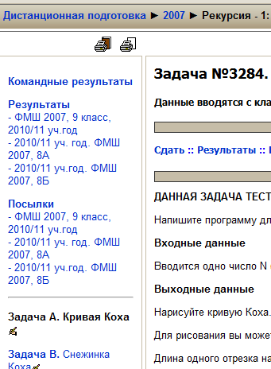
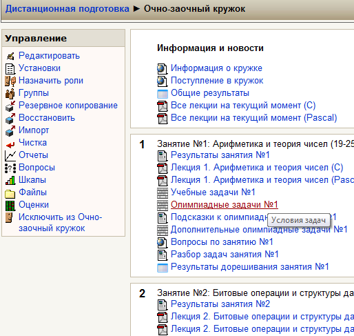

# Tutorial
1. [Авторизованный учитель](#авторизованный-учитель)
1. [Просмотр списка посылок](#просмотр-списка-посылок)
1. [Редактирование задач](#редактирование-задач)
1. [Создание групп школьников](#создание-групп-школьников)
1. [Создание курса](#создание-курса)
1. [О задачах](#о-задачах)
1. [Создание задач](#создание-задач)
1. [Редактирование задач](#редактирование-задач)
1. [Мониторы](#мониторы)
1. [Статусы посылок](#Статусы-посылок)

| Задачи| Гость| Школьник | Команда | Учитель |  Авторизованный учитель | Редактор|
| ----- |:----:| :-------:|:-------:|:-------:|:-----------------------:|--------:|
|Просмотр материалов сайта  | + | + | + | + | + | + |

# Авторизованный учитель
Статус авторизованного учителя на informatics.mccme.ru

На ресурсе informatics существует специальный тип пользователей - авторизованный учитель.

Он имеет возможность просматривать все посылки участников (исходные коды, протоколы и тесты).

Авторизованным учителями могут стать учителя и руководители кружков, которые смогут подтвердить свой статус учителя и пройти процедуру аккредитации.

Чтобы получить статус авторизованного учителя, зарегистрируйтесь как учитель и заведите тикет https://informatics.msk.ru/support/, приложив следующую информацию о себе:

Ваш логин в системе.
Ссылка на страницу образовательной организации, в которой Вы работаете.
Ссылка на свой курс на informatics
Напоминаем, что при наличии роли авторизованного учителя строго запрещается:

Копировать и публиковать и распространять тесты к задачам.
Изменять статусы посылок пользователей, которые не являются слушателями курса Авторизованного учителя.

# Просмотр списка посылок
Всем пользователям сайта доступны списки посылок: собственных по данной задаче (отображаются на странице задачи), всех пользователей по данной задаче (ссылка Посылки над условием задачи), всех пользователей по задачам данного контеста и пользователей ваших групп по задачам данного контеста (отображаются слева от условий задач), а также все собственные посылки по всем задачам (ссылка Мои посылки на главной странице) и всех посылок на сайте (ссылка Последние посылки в разделе Статистика на главной странице сайта).

Кроме того, для собственных посылок (а для авторизованных учителей - для всех посылок всех пользователей) по ссылке подробнее можно просмотреть исходный код посылки, полный протокол проверки, а также входные и выходные данные на каждом тесте.

# Редактирование задач
Отдельным пользователям дополнительно предоставляются права Редактор сайта. Эти пользователи могут редактировать условия и разборы всех задач, а также указывать новые и редактировать старые темы, отнесенные к задаче.

Кроме того, *каждый пользователь* может предложить добавить к задаче ту или иную тему из тематического рубрикатора. Эти предложения вступают в силу после авторизации администратором.

# Создание групп школьников
Для наблюдения за успехами ваших школьников вы можете объединять их в *группы*. У вас, как у создателя группы, и у всех включенных вами в группу участников на странице каждого контеста появятся новые ccылки: таблица результатов данной группы и список всех посылок данной группы:

Группу может создать любой учитель. В группу можно включать как школьников, так и других учителей (при этом изменять состав группы может только ее создатель или администраторы сайта).

Для того, чтобы создать группу:

   1. На главной странице в левом верхнем углу щелкните по ссылке Управление группами.
   2. На открывшейся странице щелкните по ссылке новая группа
   3. Введите название группы (например, "школа 125, 9А класс" и нажмите на кнопку создать.
   4. В правом окошке размещен список всех пользователей сайта. Вам предстоит выбрать нужных вам участников и перетащить их мышкой в левую часть. Для поиска нужных людей вы можете воcпользоваться сортировкой по любому столбцу (для этого достаточно щелкнуть по его заголовку) а также поиском в столбце (для этого необходимо навести мышку на правый конец заголовка нужного столбца, щелкнуть по появившейся стрелочке, выбрать в меню Фильтр и ввести текст для поиска (например, фамилию ученика, номер школы или город).
   5. Найти нужного школьника и мышкой перетащить в левую таблицу. Он сразу же будет добавлен в группу.

Чтобы исключить школьника из группы, нужно перетащить его из левой таблички в правую.

# Создание курса
Каждый учитель может создавать на сайте свои курсы:

Курс может включать в себя несколько разделов, состоящих из материалов различного типа: контестов, теоретических материалов, тестов, заданий, ссылок на файлы и веб-страницы, таблиц результатов и т.д. Ссылки на все созданные курсы отображаются на главной странице в разделе **Кружки и уроки**.

Для создания нового курса необходимо:

   1. Щелкнуть по ссылке [Создать курс](https://informatics.mccme.ru/course/edit.php?category=24) в левом верхнем углу главной страницы сайта.
   2. Указать Полное название курса. Оно обязательно должно содержать название учебного заведений или города!
   3. Выбрать короткое имя курса, которое будет указываться в строке меню.
   4. В поле количество **недель/тем** указать количество разделов (на рисунке выще они пронумерованы цифрами 1,2)
   5. Если вы хотите временно скрыть курс от посетителей сайта (до начала занятий или на время разработки), в пункте **Доступность** выберите **Курс не доступен для студентов**.
   6. Если вы не хотите допускать в курс посторонних, введите **Кодовое слово** и сообщите его всем участникам курса.
   7. Нажмите кнопку **Сохранить**. После этого вы окажетесь внутри созданного вами курса.

  В дальнейшем вы всегда сможете изменить любой из указанных параметров курса.

## Добавление учебных материалов

Для начала редактирования курса нажмите кнопку **Редактировать** в правом верхнем углу на страничке курса.

Курс состоит из вводного раздела (без номера), в котором собрана информация и материалы, относящиеся ко всему курсу целиком, а также пронумерованных разделов (1, 2, 3, ...) каждый из которых может соответствовать по вашему желанию одному занятию, одному классу, одному мероприятию и т.п.

Для указания названия (или вступления) к разделу, нажмите на  в левом верхнем углу соответствующего раздела. В этом поле вы можете написать любой текст в формате html, например:

    <b>Условный оператор</b> Задачи этого раздела нужно сдать до 5 февраля.

или просто указать название раздела, например:

**Условный оператор**

Далее, в каждый раздел вы можете добавить различные учебные материалы, выбрав соответствующую строчку в выпадающем меню. Приведем краткие описания наиболее полезных видов материалов.

   *  **Условия задач**: контест, составленный из задач, имеющихся в тестирующей системе сайта. Школьникам будут доступны условия задач и возможность сдачи решений в тестирующую систему. Отметим, что эти материалы являются основным содержанием сайта, и мы надеемся, что вы будете создавать курсы с использованием задач с автоматическим тестированием.
   *  **Таблица результатов**: сводная таблица по нескольким контестам для данной группы.
   *  **Пояснение**: небольшой фрагмент текста на странице курса (в формате html)
   *  **Текстовая страница**: отдельный текстовый документ, который вы планируете написать, со ссылкой на него со страницы курса.
   *  **Веб-страница**: то же, но в формате html
   *  **Ссылка на файл или веб-страницу**: ссылка на существующую страницу в сети интернет или на страницу или файл на данном сайте. Вы также можете предварительно закачать файлы в свой курс и поставить ссылку на них.

Также вы можете создавать тесты, задания. опросы и т.п.

После создания любого материала справа от него появятся значки: перенести вправо (сделать отступ), перенести (в другое место курса), редактировать (сам материал и/или его настройки), удалить, спрятать (от школьников).

## Создание контеста
*Контест* - это набор задач на одну тему, либо предлназначенный для решения на одной олимпиаде, тренировке итп.

Для каждого контеста доступна своя таблица результатов, а также список посылок, сделанных школьниками по задачам данного контеста. Одна задача может входить в разные контесты, при ее решении результаты (в таблице результатов и списке посылок) появляются *сразу во всех контестах, содержащих данную задачу*.

Для создания контеста выберите в выпадающем меню **Добавить ресурс** в соответствующем разделе вашего курса пункт **Условия задач**. В поле название укажите заголовок контеста (например: **Условный оператор** или **Тренировка №5**). Если вы планируете провести олимпиаду и контрольную работу, вы можете отметить флажок **Не показывать разборы, темы и т.д.** - в этом случае школьникам не будут показываться различные подсказки.

Если вы пока не хотите открывать данный контест для школьников, выберите в пункте **Доступные** вариант **Спрятать**.

Нажмите кнопку **Сохранить**.

После этого вы сможете выбрать задачи для данного контеста. Для этого есть два основных способа:

1. **Выбрать задачи из тематического рубрикатора**. После перехода по данной ссылке вы попадете в тематический рубрикатор. Там присутствуют не все, но большая часть задач, имеющихся в тестирующей системе, и он постоянно пополняется. Под каждой задачей есть ссылка добавить, которая перемещает данную задачу в ваш контест. После выбора всех необходимых задач нужно нажать ссылку **Создать контест** в левом верхнем углу.

2. **Добавить задачи по id (идентификационному номеру)**. Вы можете предварительно выбрать интересующие вас задачи в других разделах сайта и выписать себе их номера, а затем ввести их, перейдя по данной ссылке.

*Продвинутым пользователям, знакомым со структурой контестов в ejudge данного сайта, доступна также возможность выбирать задачи непосредственно из контестов в тестирующей системе.*

После выбора задач вы можете менять их порядок и удалять или скрывать те или иные задачи.

# О задачах
Задача - это основной объект на данном сайте. Данный сайт в первую создавался в первую очередь как база задач по программированию для школьников с автоматической проверкой. Чтобы успешно использовать его в своей деятельности, необходимо прежде всего понять, что такое задача и как она устроена.

## Структура задачи
Каждая задача включает в себя:

   1. **Id** - уникальный числовой идентификатор, по которому вы можете получить доступ к данной задаче из окошка на главной странице, по которому вы можете добавить задачу в контест и который удобнее всего использовать при ссылке на данную задачу.
   2. **Название задачи**
   3. **Условие задачи** - хранится на сайте в формате html. Некоторые задачи опуликованы без условий, либо по лицензионным соображениям (задачи взяты из книг), либо потому что добавивший их учитель не хочет раньше времени показывать условие ученикам.
   4. **Темы** - большинству задач приписаны одна или несколько тем из *Тематического рубрикатор*. Вы можете предложить новые темы для каждой задачи, после одобрения администратором они будут прикреплены к задаче.
   5. **Разбор** - описание решения задачи. Как правило, разборы написаны школьниками-участниками сайта, и мы не несем ответственности за их содержание и грамотность. При этом данные тексты часто бывают полезны школьникам, поэтому пока мы оставили их на сайте в таком виде.
   6. **Описание** - краткий текст для учителя, описывающий задачу и/или ее решение.
   7. **Тестирующий модуль: тесты и проверяющие программы** - практически все задачи на сайте сопровождаются возможностью их автоматической проверки.
   8. **Посылки** - список всех посланных на проверку решений с указанием результатов проверки. Авторизованным учителям и администраторам также доступны тексты всех решений и тестов и правильных ответов. Остальным участникам доступны только тексты своих решений, протоколы проверки, а также - для некоторых задач, как правило, личных олимпиад начального уровня - тесты и правильные ответы.
   9. **Результаты** - таблица результатов по данной задаче.
Одна и та же задача может присутствовать в разных контестах, при этом сдача решения в одном контесте влечет за собой появление информации о посылке и результатах данного участника по данной задаче во всех контестах, куда входит эта задача.

Список всех ваших посылок доступен в меню на главной странице сайта (ссылка **Мои посылки**).

# Создание задач

# Редактирование задач

Отдельным пользователям дополнительно предоставляются права Редактор сайта. Эти пользователи могут редактировать условия и разборы всех задач, а также указывать новые и редактировать старые темы, отнесенные к задаче.

Кроме того, *каждый пользователь* может предложить добавить к задаче ту или иную тему из тематического рубрикатора. Эти предложения вступают в силу после авторизации администратором.

# Мониторы
Иногда бывает удобно объединить в одну таблицу результатов несколько контеcтов (например, все уроки данного класса или два тура одной олимпиады).

Создание таких таблиц результатов делается в два шага.

1. **Создание набора контестов (монитора)**. На главной странице в разделе Рабочий стол учителя пройдите по ссылке Управление мониторами, далее: создать монитор и укажите название создаваемого монитора. Выберите контесты, которые необходимо в него включить и перетащите их мышью из правой таблицы в левую.

2. **Создание таблицы результатов**. Находясь в своем курсе, нажмите кнопку редактировать, в нужном разделе в выпадающем меню Добавить реcурс... выберите пункт Таблица результатов. Укажите ее название, выберите в пункте Таблица результатов созданный вами в п.1 монитор, а в пункте Группа - интересующую вас группу школьников либо пункт Все участники. Нажмите Сохранить.

В мониторе указываются только те участники, которые сделали в указанных контестах хотя бы одну посылку, и только те контестых, в которых указанные участники сделали хотя бы одну посылку.

Чтобы сделать монитор по секретной ссылке, можно сделать следующее:

1) найти id нужных контестов, например https://informatics.mccme.ru/course/view.php?id=34 — id это 34
2) сгенерировать секретную ссылку, для этого нужно отправить POST-запрос на /py/monitor, с нужными параметрами

Параметры:
contest_id=1&contest_id=2&contest_id=3 ... -- нужные id контестов aka модулей курсов
group_id=4 -- группа, по которой делается монитор, если не указывать, будет по всем пользователям
time_before=1521742439 -- время в timestamp, до которого собирать посылки
time_after=1521742439 -- время в timestamp, после которого собирать посылки

Можно сделать это например с помощью js в консоли браузера на сайте информатикса:

url = 'https://informatics.msk.ru/py/monitor?contest_id=19635&group_id=11139'
jQuery.post(url, (data) => console.log(data))
> {link: "b1gefbmozwa72hasnj8z"}

или

url = 'https://informatics.msk.ru/py/monitor?contest_id=19635&group_id=11139&time_before=1521742439'
jQuery.post(url, (data) => console.log(data))
> {link: "g0fa6u928we50w1pdow9"}

Из запроса вернётся JSON с токеном для доступа к монитору

3) Вставить токен вот сюда, https://informatics.msk.ru/py/monitor/<link>/render -- это будет собственно монитор, например
https://informatics.msk.ru/py/monitor/b1gefbmozwa72hasnj8z/render
https://informatics.msk.ru/py/monitor/g0fa6u928we50w1pdow9/render

Параметры:
partial_score=on -- показывать баллы, например:
https://informatics.msk.ru/py/monitor/b1gefbmozwa72hasnj8z/render?partial_score=on

Так же можно получить и чистый JSON:
https://informatics.msk.ru/py/monitor/b1gefbmozwa72hasnj8z
https://informatics.msk.ru/py/monitor/g0fa6u928we50w1pdow9

Чтобы сгенерировать ссылку, нужно быть авторизованным учителем; чтобы увидеть монитор, нужно быть залогиненым

# Статусы посылок

После автоматического тестирования каждое решение получает статус проверки: OK, неполное решение, превышен лимит времени, превышен лимит памяти, и т.д.

Авторизованные учителя могут вручную изменять статус проверки. Обычно вручную устанавливаются следующие статусы:

1. **Ошибка оформления кода**: этот статус устанавливается учителем, если ему не нравится, как отформатирован код, как названы переменные и т.п.
2. **Проигнорировано**: этот статус означает, что учитель по тем или иным причинам не хочет засчитывать данное решение (например, использован не тот алгоритм итп)
3. **Дисквалифицирован**: решение не засчитано по причине списывания и т.п.

## Варианты статусов посылок

| Сокращение    | In English          | Расшифровка |
| ------------- |:-------------------:| -----------:|
| OK            | OK                  | OK          |
| RJ            | Rejudge             | Перетестировать |
| AC            | Accepted for Testing| Зачтено/Принято |
| SV            | Style Violation     | Ошибка оформления кода |
| IG            | Ignore              | Проигнорировано |
| CE            | Compilation Error   | Ошибка компиляции |
| DQ            | Disqualified        | Дисквалифицировано|
| PT            | Partial Solution    | Частичное решение |
| PD            | Pendin              | Ожидает проверки  |
| RT            | Run-Time Error      | Ошибка во время выполнения программы |
| TL            | Time-Limit Exceeded | Превышено максимальное время работы |
| PE            | Presentation Error  | Неправильный формат вывода |
| WA            | Wrong Answer        | Неправильный ответ |
| CF            | Check Failed        | Ошибка проверки, обратитесь к администраторам |
| ML            | Memory Limit Exceeded| Превышение лимита памяти |
| SE            | Security violation  | Security error |
| RU            | Running             | Проверяется |
| CG            | Cpmpilling          | В очереди компиляции или компилируется |
| AW            | Awaiting            | В очереди проверки |

