# Polygon Tutorial

1. [Для опытных пользователей](#для-опытных-пользователей)
2. [Основные отличия от обычной подготовки задач в Polygon](#основные-отличия-от-обычной-подготовки-задач-в-polygon)
3. [У меня готовы задачи, они не подходять по каким-то критериям, но я не хочу их изменять](#у-меня-готовы-задачи-они-не-подходять-по-каким-то-критериям-но-я-не-хочу-их-изменять)
4. [Основные принципы работы с Polygon](#основные-принципы-работы-с-polygon)
5. [Подготовка задачи (для начинающих пользователей)](#подготовка-задачи-для-начинающих-пользователей)
6. [Подготовка контеста](#подготовка-контеста)

# Для опытных пользователей
Чтобы залить собственные задачи на [informatics.msk.ru](https://informatics.msk.ru), вам нужно подготовить их в системе [Polygon](https://polygon.codeforces.com).

После того, как задачи готовы к заливке на сайт, необходимо объединить их в [контест](#подготовка-контеста) и выдать права на этот контест пользователю **informatics**.

После этого надо создать заявку в [тикитнице](https://informatics.msk.ru/support/open.php).

В заявке необходимо указать номер контеста, из которого нужно заливать задачи.

## Основные отличия от обычной подготовки задач в Polygon

Если вы уже готовили задачи в Polygon, то, скорее всего, вам будет неинтересно читать инструкцию по [подготовке задачи](#подготовка-задачи-для-начинающих-пользователей), поэтому в этом разделе приведены основные отличия от обычной подготовки задачи:

1. Должна собираться html версия русского [условия](#statement). Условие обязательно должно быть на русском языке.
2. Во вкладке Files в разделе Attachments надо загрузить [valuer.cfg](#valuercfg).
3. Если вы не хотите выдавать **WRITE** права на задачу пользователю **informatics**, вам самим надо будет собрать _Full Package_ последней ревизии задачи.<!-- Я предлагаю переписать этот пункт т.к. мы не рассказываем какие еще есть варианты. Изначально мы рассказываем о процедуре людям, которые делают это впервые в жизни, а тут говорим write, что такое для чего и т.д. неочевидно -->
4. В задаче должны быть проставлены теги. Например, если задача на бинарный поиск по ответу, в ней должен быть тег _binary search_. Теги надо добавлять в [general info](#general-info).
5. Если задача содержит _Input/Output for statements_ то желательно просто сделать if на тест из условия в авторском решении. Если это невозможно, то предупредить в заявке о такой задаче. Если вы забудете предупредить, то, возможно, человек, заливающий задачи, этого не заметит, и все будут видеть _Output_ авторского решения.
6. Чекер и интерактор в задаче должны быть написаны на любом языке кроме java (из-за проблем с ejudge).
7. Семплы должны быть первыми тестами в задаче
8. [Контест](#подготовка-контеста) с задачами должен содержать минимально возможное количество [warning](#warning-в-контесте).

## У меня готовы задачи, они не подходять по каким-то критериям, но я не хочу их изменять

К сожалению, их предется изменить, задачи не подходящие по критериям залиты не будут.

Если у вас есть задача с какой-то олимпиады и ее не хочется изменять, то можно создать ее копию и делать все исправления в этой копии.

Чтобы создать копию задачи нажмите кнопку _Advanced_ в [general info](#general-info).

После этого введите название для копии задачи и нажмите _Clone_.

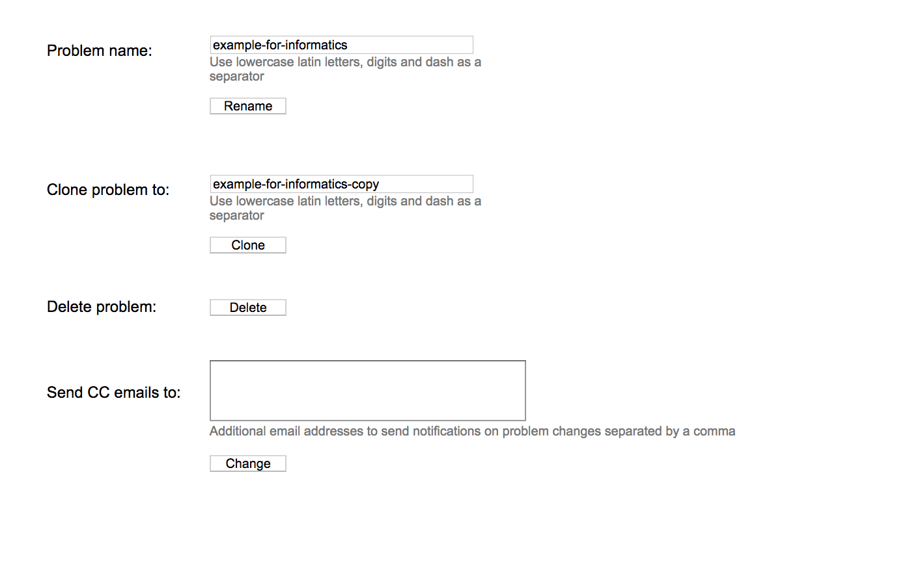

Будет создана полная копия задачи. Обратите внимание, [manage access](#manage_access) не будет скопирован. Вы будете единственным человеком с правами на копию задачи. 
После этого внесите все нужные изменения в копию задачи.

# Основные принципы работы с Polygon

Если вы никогда раньше не использовали Polygon, то для начала нужно зарегистрироваться.

При первом входе в аккаунт, вы увидите набор из трех задач — примеров.

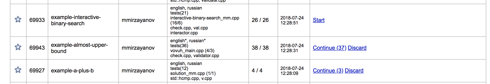

В любой момент можно открыть каждую из этих задач и использовать в качестве примера. Для этого кликните на _Start_ напротив задачи, или _Continue_, если вы уже открывали задачу.

В основном, работа с Polygon напоминает работу с любой *системой контроля версий* <!-- Это сравнение очевидно для тебя, но я не могу понять насколько оно очевидно для не таких крутых челиков как ты -->. Вы берете вашу рабочую копию и начинаете вносить изменения.

После того, как все изменения внесены, нажмите кнопку _Commit Changes_, чтобы закоммитить ваши изменения.

Эта кнопка доступна только для задач, на которые у вас есть **WRITE** права. Если у вас только **READ** права, вы все еще можете изменять рабочую копию, но не сможете закоммитить изменения.

Если в задаче есть незакоммиченые изменения, то строка с ней выделяется красным цветом.

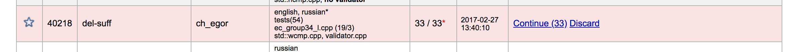

Чтобы отменить все изменения, внесенные в рабочую копию, нажмите _Discard_ (осторожно, это действие отменить нельзя).

Чтобы посмотреть все доступные вам задачи, нужно нажать кнопку _View Problems_. 
Чтобы посмотреть на все доступные вам контесты, надо нажать _View Contests_.

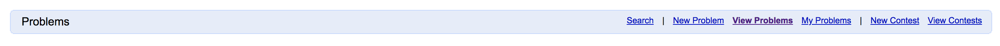

Чтобы выйти из задачи, тоже можно нажать _View Problems_, если задача принадлежит какому-то контесту, то у вас еще будет кнопка _Contest_, позволяющая перейти к этому контесту.

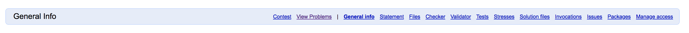

# Подготовка задачи (для начинающих пользователей)

1. [Создание новой задачи](#создание-новой-задачи)
2. [Интерфейс задачи](#интерфейс-задачи)

## Создание новой задачи

Нажмите _New Problem_, вам будет предложено выбрать рабочее название задачи.

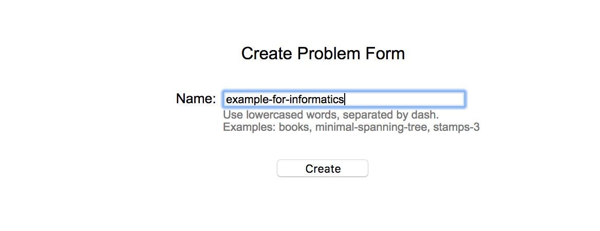

После этого вас перекинет на главную страницу со всеми задачами и вы сможете выбрать свою задачу.

## Интерфейс задачи

1.  [Основной интерфейс задачи](#основной-интерфейс-задачи)
2.  [General info](#general-info)
3.  [Statement](#statement)
4.  [Files](#files)
5.  [Checker](#checker)
6.  [Interactor](#interactor)
7.  [Validator](#validator)
8.  [Tests](#tests)
9.  [Stresses](#stresses)
10. [Solution files](#solution-files)
11. [Invocations](#invocations)
12. [Issues](#issues)
13. [Packages](#packages)
14. [Manage access](#manage-access)
15. [valuer.cfg](#valuercfg)

### Основной интерфейс задачи

Визуализация основного интерфейса задачи. Сверху есть набор вкладок, позволяющий изменять конкретные элементы в задаче.

В меню справа коротко показаны основные параметры задачи (Все testset и количество тестов в них, какой в задаче checker, авторское решение, и.т.д.).

Чуть ниже этого меню показаны изменения в нашей рабочей копии и в нем же содержатся кнопки для коммита изменений.

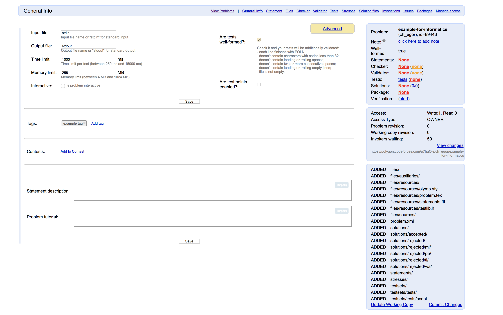

### General info

На этой странице содержится основная информация о задаче.

А именно:

1. Название входных/выходных файлов. По умолчанию стандартный ввод/вывод. При заливке на informatics их менять нельзя
2. Максимальное время работы программы и максимальный объем допустимой памяти на одном тесте. При заливке на informatics некоторые из этих параметров могут увеличится, так как сервера informatics медленнее серверов Polygon.
3. _Interactive_ - является ли задача интерактивной. При выборе этой опции вам дополнительно добавится меню для загрузки интерактора
4. _Are tests well-formed_ - полезная опция для правильного форматирования тестов. Отключать можно только в исключительных случаях, когда в задаче нужно нетривиально распарсить ввод.
5. _Are test points enabled_ - разбалловка для задачи. Эта опция не переносится при загрузке задач на сайт и ее необязательно включать. Вместо этого нужно написать [valuer.cfg](#valuercfg).
6. Теги. В задаче должен быть хоть один тег. Например, если задача на бинарный поиск по ответу, в ней должен быть тег _binary search_.

### Statement

Окно для подготовки условия задачи. Для начала нужно создать условие задачи, для этого следует нажать _Create New_, выбрать язык и затем нажать _Create_.

После этого перед вами появится вот такое окно.

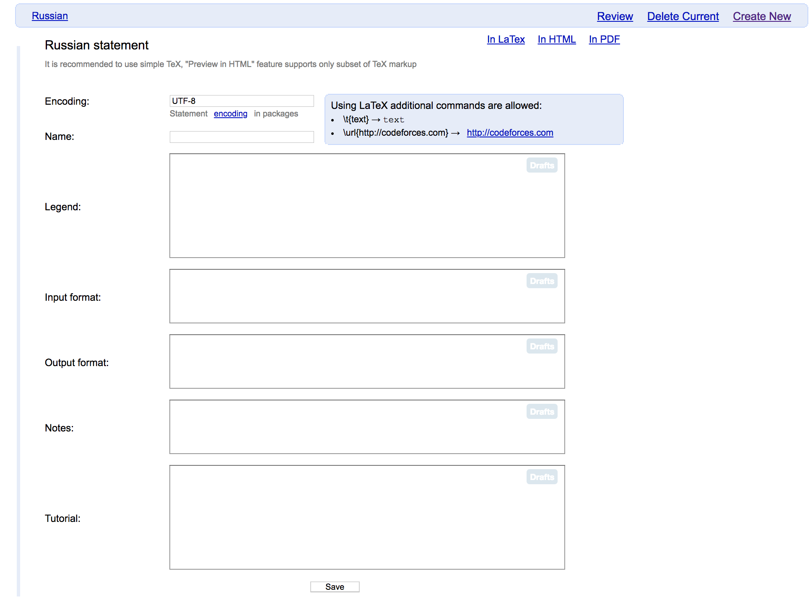

Условие должно быть в формате _Latex_. Чтобы посмотреть как выглядит ваше условие, нужно кликнуть _In HTML_. Не рекомендуется использовать очень сложную верстку, т.к. html версия условия поддерживает не все.

Тестовые примеры из условия автоматически сгенерируются из помеченных тестов в задаче, их не нужно добавлять вручную.

Посмотреть примеры написания условий можно в демонстрационных задачах (например в _example-almost-upper-bound_).

**В вашей задаче обязательно должна собираться русская версия условия в html.**

### Files

Раздел с файлами задачи. Вы можете в _Source Files_ положить коды генераторов тестов, чекера, валидатора.

В раздел _Attachments_ вы можете добавлять любые фалы. В этот раздел обязательно должен быть добавлен [valuer.cfg](#valuercfg).

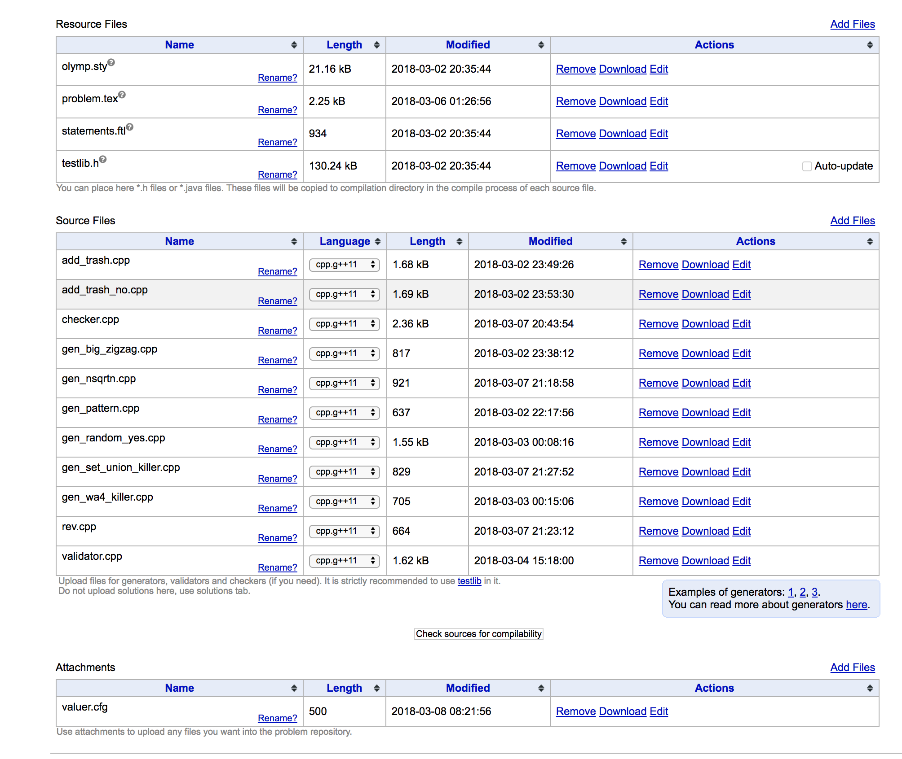

### Checker

Раздел с проверяющей программой. Всегда старайтесь использовать одну из стандартных проверяющих программ.

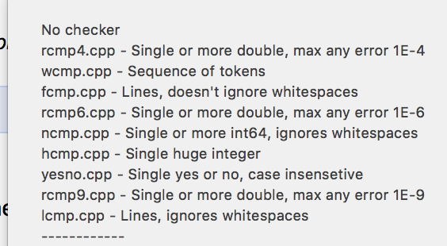

Если это невозможно, напишите чекер следуя [этой инструкции](https://codeforces.com/blog/entry/18431)

**В ejudge есть проблемы с чекерами на java. Задачи с чекерами на этом языке залиты не будут. Чтобы залить задачу, перепишите чекер на другом языке.**

### Interactor

Если задача интерактивная, в задачу добавляется этот раздел.

При написани Интерактора можно руководствоваться [этой инструкцией](https://codeforces.com/blog/entry/18455).

Даже при наличии интерактора в задачу нужно добавить чекер. В данном случае, чекер будет проверять вывод интерактора в _tout_.

Если вы все проверяете на стороне интерактора, просто добавьте чекер, который возвращает exit code 0 в любом случае.

**Поскольку в ejudge есть проблемы с интеракторами на java, то задачи с интеракторами на этом языке залиты не будут, пока интерактор не будет переписан на другой язык.**

### Validator

Раздел с программой проверяющей корректность тестов. Валидатор можно написать по [этой инструкции](https://codeforces.com/blog/entry/18426).

Валидатор - обязательный критерий для заливки задач. Исключения обговариваются отдельно.

### Tests

1. [Ручные тесты и загрузка файлов с тестами](#ручные-тесты-и-загрузка-файлов-с-тестами)
2. [Генерируемые тесты](#генерируемые-тесты)

Polygon предоставляет возможность работы с несколькими наборами тестов, обхединяя их в _testset_.
Не смотря на это, ejudge скачивает только основной тестсет с названием _Tests_, поэтому возможность работы с несколькими тестсетами рассмотрена не будет

Так же важной особеностью Polygon является то, что **нельзя руками указать ответ на тест**, все ответы на тесты генерируются авторским решением.

Единственое, что можно указать, это то, какой будет сам тест (да, Polygon позволяет изменить содержимое теста для условия задачи, это бывает полезно для интерактивных задач) и ответ на него в условии задачи, но этой опцией не рекомендуется пользоваться в обычных задачах, т.к. она не заменяет реальный ответ на тест в файлах задачи, и при заливке на informatics можно забыть его подменить (informatics всегда генерирует условия из файлов с тестами и не умеет автоатический загружать _Input/Output for statements_).

Интерфейс работы с тестами выглядит вот так:

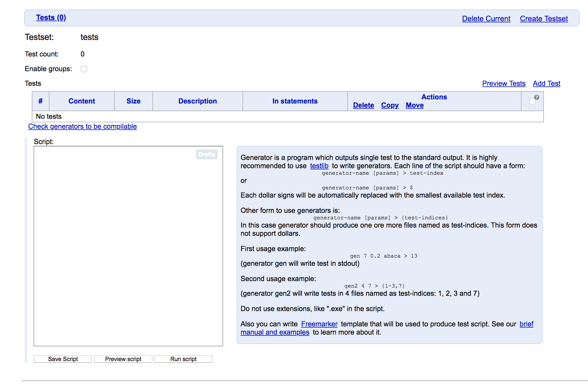

#### Ручные тесты и загрузка файлов с тестами

Чтобы добавить тест, надо нажать на _Add Test_. После этого вам откроется следующее меню:

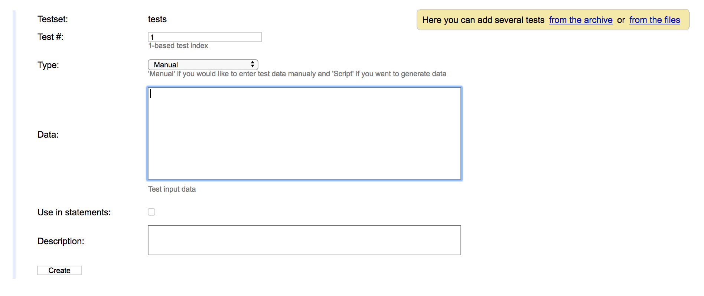

Тут можно ввести входные данные для теста. Если вы хотите использовать тест в условии, нужно нажать соответствующую галочку.

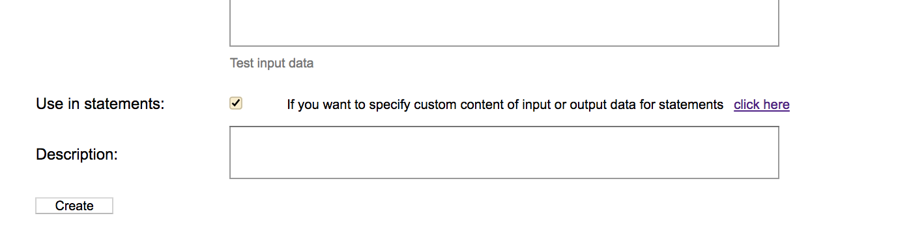

Чтобы указать _Input/Output for statements_, надо нажать _click here_ в появившемся тексте.

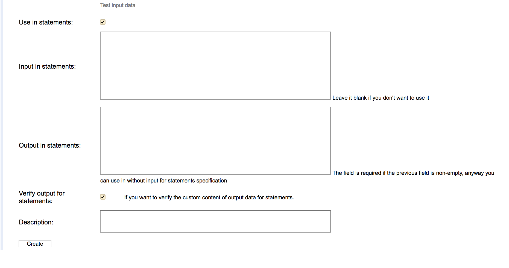

Галочка в самом низу означает, что _Input/Output for statements_ надо проверять при помощи [валидатора](#validator) и [чекера](#checker). Обычно эту опцию отключают только для интерактивных задач.

Также вы можете добавить тесты из архива или фалов, для этого справа сверху нажмите _from the archive_ или _from the files_.

Если вы выбрали _from the archive_, то все файлы из выбраного вами архива будут добавленный в качестве тестов, поэтому надо не забыть удалить из него лишние файлы (обычно это файлы с ответами на тесты).

Если вы выбрали _from the files_, то вы можете загрузить сразу несколько файлов, все они будут добавлены в качестве тестов.

После того, как тесты добавленны, их можно редактировать, для этого перейдите на главную страницу с тестами и нажмите _edit_ напротив теста. Это бывает полезно, если вы забыли указать что какой-то тест является тестом из условия.

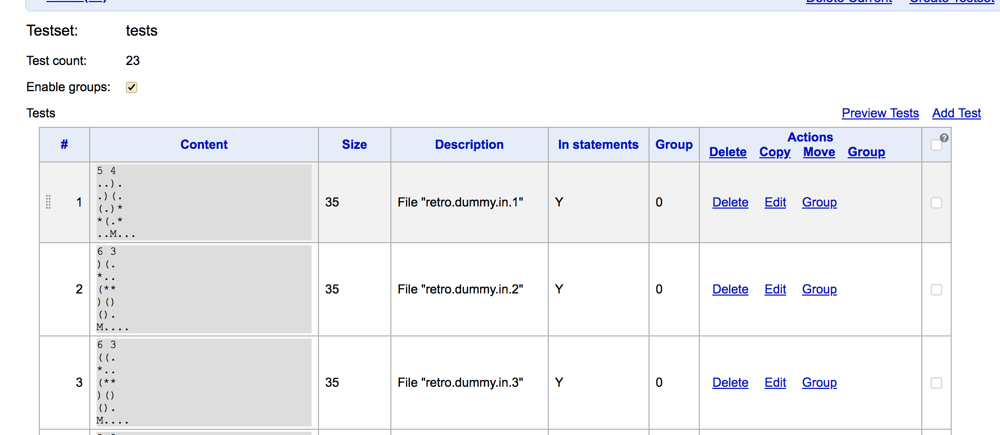

**Все тесты из условия должны быть первыми тестами в задаче.**

#### Генерируемые тесты

Чтобы сделать генерируемый тест, вам сначала надо написать генератор теста по [этой инструкции](https://codeforces.com/blog/entry/18291).

После этого вам надо добавить генератор в раздел [files](#files) в _Source Files_.

Далее вам надо изменить скрипт для генерации тестов.

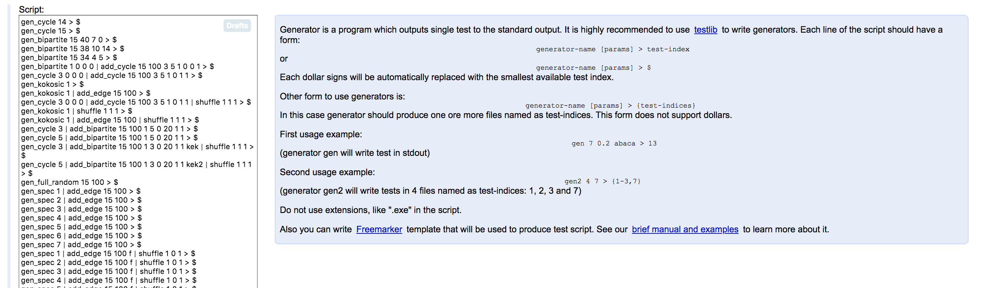

Более подробно как писать скрипт написано в меню справа.

**Использовать генерируемые тесты более предподчительно, чем генерировать тесты локально и загружать файлы с ними.**

**Желательно не делать тесты из условия генерируемыми тестами.**

### Stresses

Тут вы можете запустить стресс решений, и, в случае успеха (или провала, если авторское решение упадет), добавить найденный тест в задачу.

### Solution files

Раздел в который надо загружать решения. В этом разделе будет только одно решение помеченное как _Main correct solution_, оно используется для генерации ответов на тесты.

Для остальных решений можно поставить специальные теги. Эти теги должны быть корректны на всех тестах (например решение помеченное как _Time limit exceeded_ не должно выдавать неправильных ответов), иначе валидация задачи не пройдет.

Если вердикт может быть произвольным, надо поставить тег _Incorrect_.

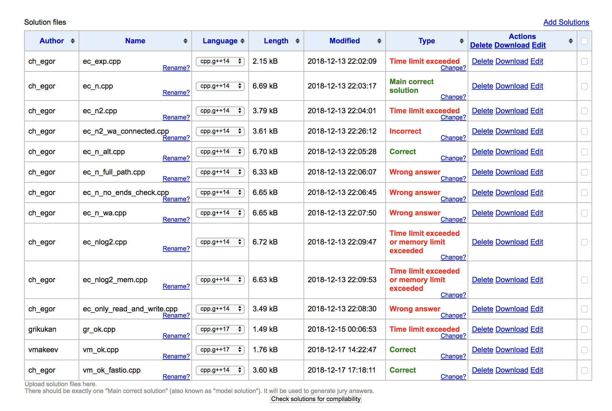

### Invocations

В этом разделе вы можете запускать решения на различных тестах.

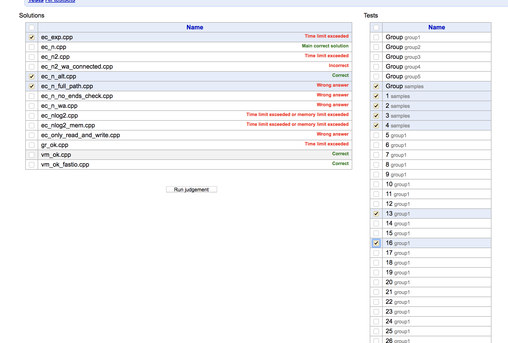

И смотреть результаты запуска.

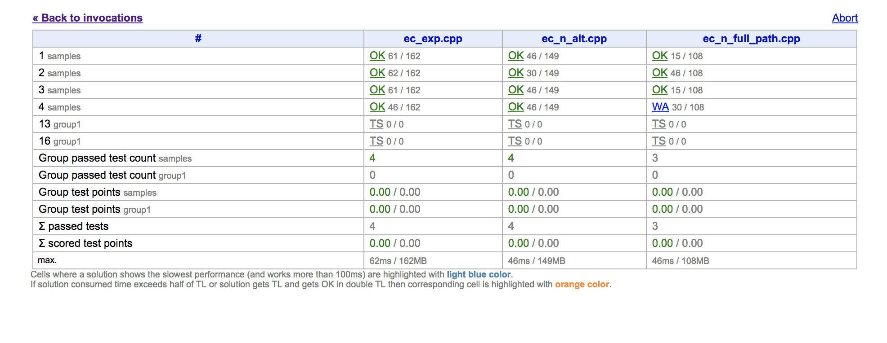

### Issues

Раздел в котором можно оставлять Issue.

### Packages

Раздел в котором надо собирать пакет с задачей. Для заливки задачи на informatics у нее должен быть собран _Full Package_ для последней ревизии с включенной верификацией.

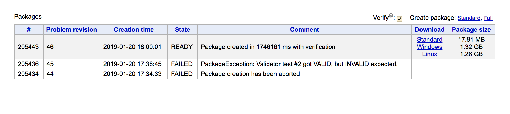

### Manage access

В этом разделе вы можете добавлять пользователей, которые могут смотреть или редактировать задачу. Чтобы задача была залита на сайт informatics, нужно добавить пользователя **informatics**.

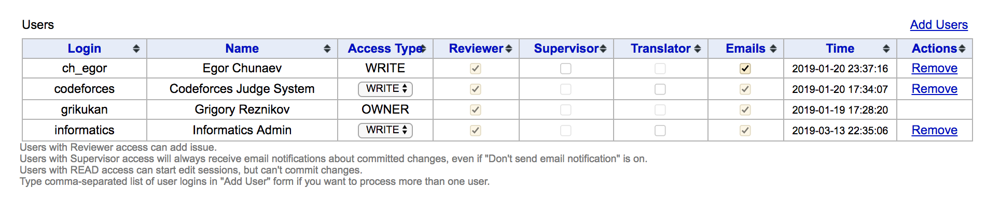

### valuer.cfg

Поскольку informatics использует ejudge, вам нужно написать valuer.cfg для оценивающие программы gvaluer. Как его писать можно [прочитать тут](https://ejudge.ru/wiki/index.php/Gvaluer).

После того, как вы его напишите, в разделе [Files](#files) залить его в _Attachments_.

**Наличие valuer.cfg является обязательным условием для заливки задачи. Даже если задача оценивается как 0 или 100 баллов, вам необходимо добавить valuer с одной группой содержащей все тесты.**

# Подготовка контеста

1. [Создание нового контеста](#создание-нового-контеста)
2. [Основной интерфейс контеста](#основной-интерфейс-контеста)
3. [Как добавить существующую задачу в контест](#как-добавить-существующую-задачу-в-контест)
4. [Как дать пользователю права на контест](#как-дать-пользователю-права-на-контест)
5. [Warning в контесте](#warning-в-контесте)

## Создание нового контеста

После того, как вы создали задачи, их нужно объединить в контест.

Для этого нажмите _New Contest_ и введите название контеста. _Main language_ должен быть русским.

Остальные поля заполнять необязательно.

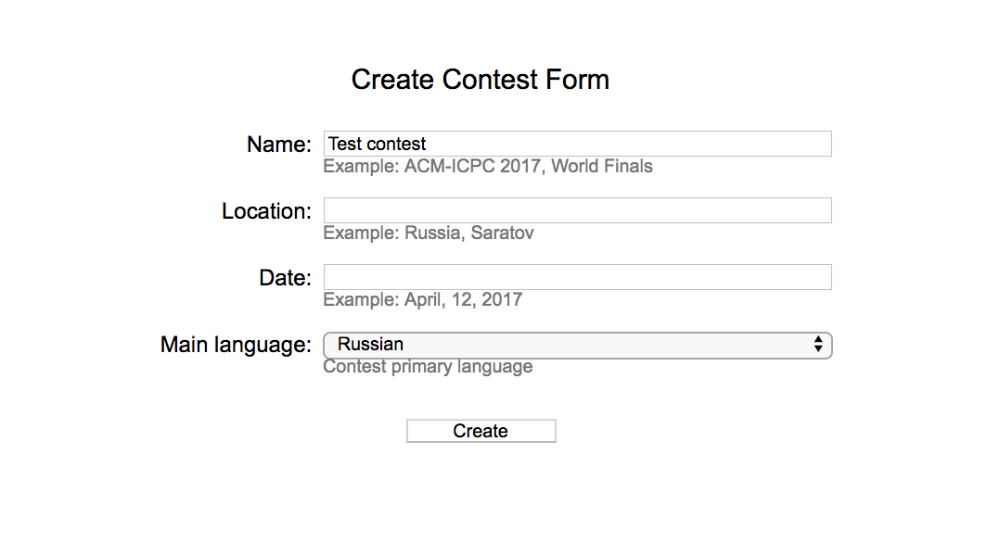

## Основной интерфейс контеста

Чтобы зайти в контест, зайдите во вкладку _View Contests_ и нажмите _Enter_ напротив контеста.

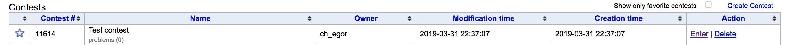

После этого вы попадете на основную страницу контеста.

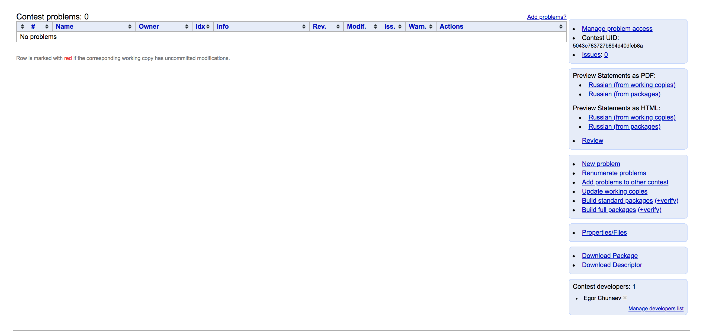

В меню справа есть набор операций над контестом

В самом верху есть кнопка _Manage problem access_, при помощи которой можно выдавать права одновременно на все задачи в контесте (а не отдельно в каждой задаче).

Далее есть секция с условиями, в ней можно смотреть условия всех задач одноврено. Условия можно собирать как в html, так и в pdf. Также можно выбрать, берутся ли условия из рабочих копий или из последних собранных package.

Дале есть меню для операций над задачами:

1. _New problem_ - создать новую задачу и добавить ее в контест
2. _Renumerate problems_ - Присвоить новые индексы задачам (обычно в качестве индексов используют заглавные буквы латинского алфавита). Задачи будут отсортированны в алфавитном порядке по индексам.
3. _Add problems to other contest_ - выбрать задачи из этого контеста и добавить их в другой контест
4. _Update working copies_ - обновить рабочую копию во всех задачах
5. _Build standard packages (+verify)_ - собрать во всех задачах _Standard package_ без verify. Если нажать на _+verify_, то package будут собраны с verify.
6. _Build full packages (+verify)_ - собрать во всех задачах _Full package_ без verify. Если нажать на _+verify_, то package будут собраны с verify.

Чтобы изменить какие-то свойства контеста (например название, или добавить еще один язык в контест), надо нажать на _Properties/Files_.

В самом низу можно добавлять разработчиков в контест.

Если в контесте уже есть задачи, то снизу будут показываться последние коммиты по задачам.

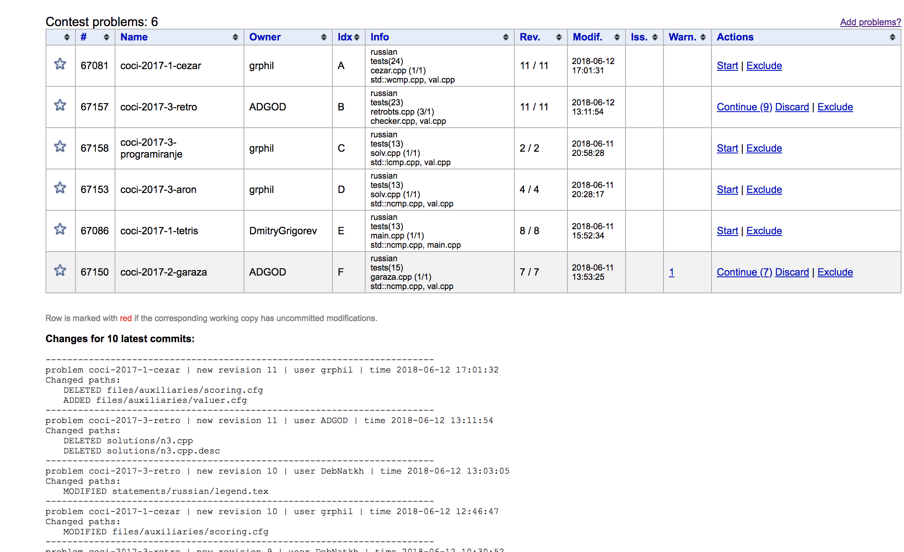

## Как добавить существующую задачу в контест

Для этого нажмите на кнопку _Add problems?_ справа сверху.

После этого вы увидете вот такое окно.

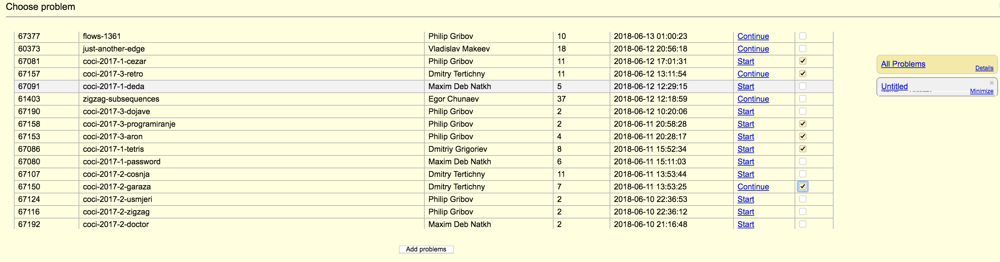

В нем выбирите нужные задачи и нажмите _Add problems_.

## Как дать пользователю права на контест

Для этого справа снизу нажмите _Manage developers list_.

Перед вами откроется вот такое окно.

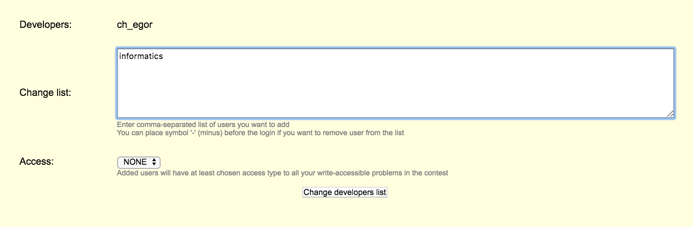

Вам нужно будет ввести список логинов, которым вы ходите дать права на контест и указать, какие права они получают на имеющиеся задачи в контесте.

Затем надо просто нажать _Change developers list_.

**Обращаем внимание, что в этот момент вы выдаете права только на существующие в данный момент задачи. При добавлении новой задачи в контест - права на нее необходимо выдать вручную.**

Проще всего выдать права на новую задачу, нажав справа сверху _Manage problem access_.

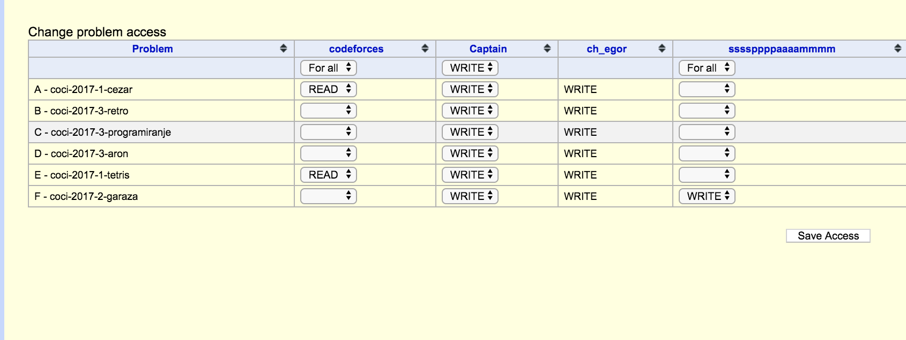

В этом меню вы можете выставить права на каждую задачу каждому из пользователей в контесте.

В этом меню также показываются все пользователи, которые имеют хоть какие-то права на задачи из контеста, при этом они не обязательно должны иметь права на сам контест.

## Warning в контесте

В задачах есть столбец _Warn._. В этом столбце показываются разные предупреждения, обычно сведетельствующие о том, что задача не до конца готова.

Есть пара ислючительных случаев, когда предупреждений избежать нельзя (например _Input/Output for statements_ в интерактивных задачах), но желательно убирать все возможные предупреждения.

Чтобы увидеть список предупреждений в задаче, нажмите на цифру в графе _Warn._ и они появятся под задачами.

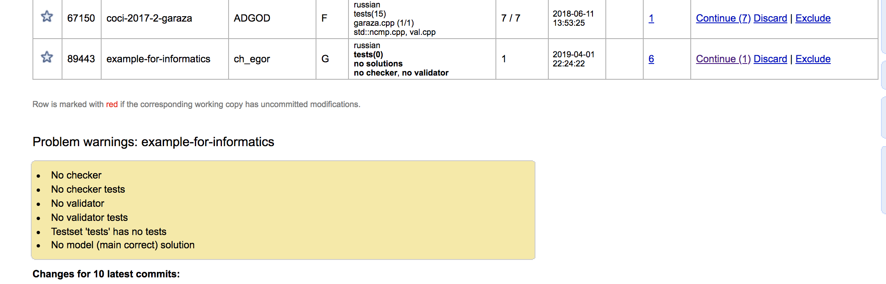
